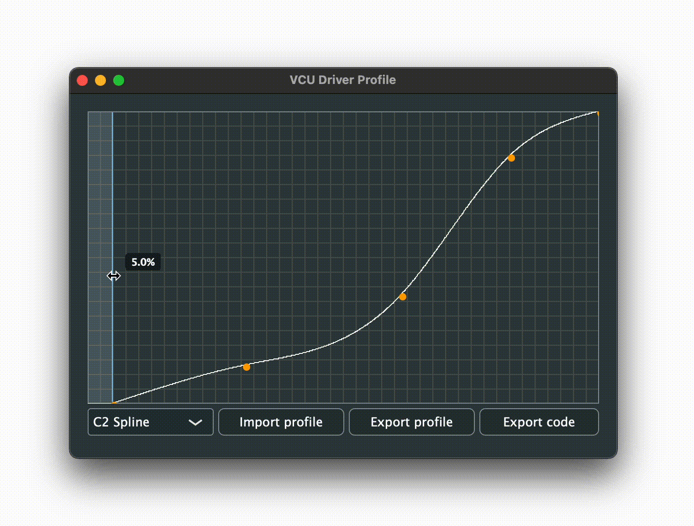
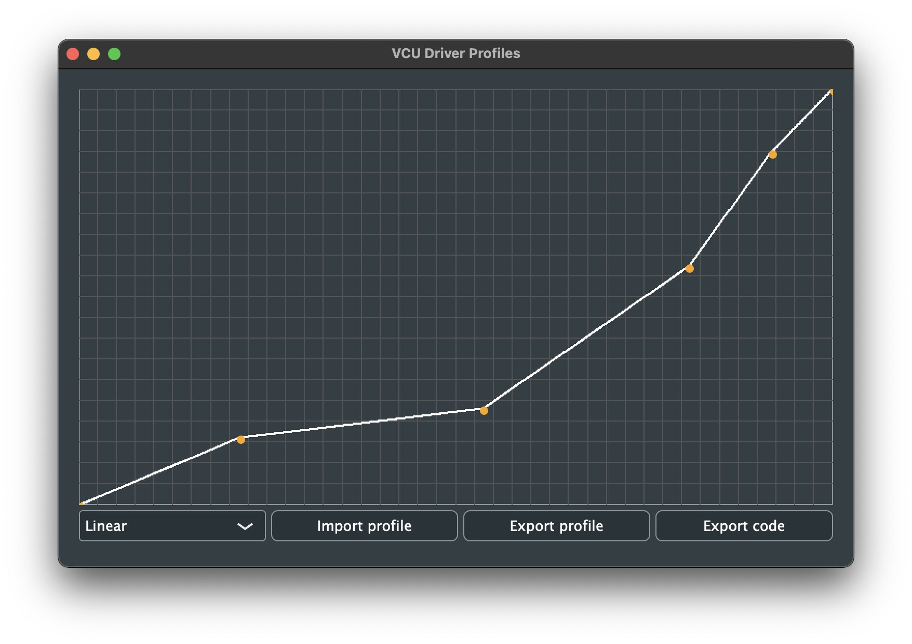
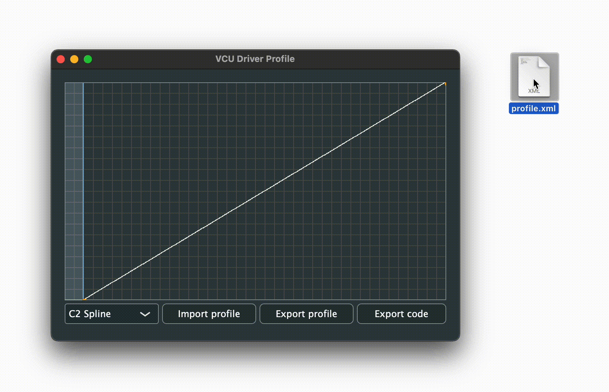

# VCU GUI

A cross-platform graphical tool for configuring the parameters of the VCU.

<p align="center">
  
</p>

## Installing

Releases of this tool are pre-compiled for macOS and Windows as a standalone application. The latest release is available [here](https://github.com/sufst/vcu-driver-profile/releases), or use one of the links below for a direct download:

- [macOS](https://github.com/sufst/vcu-driver-profile/releases/download/v1.0.0/VCU.Driver.Profile.app.zip)
- [Windows](https://github.com/sufst/vcu-driver-profile/releases/download/v1.0.0/VCU.Driver.Profile.exe)

The program can also be compiled and run on Linux using `cmake` and `make` (see: [build process](#Initial-Setup-and-Build-Process)).

## Creating a Torque Profile

The torque profile defines the mapping between accelerator pedal pressure and requested torque.

### Adding Points

The default torque profile is linear. Points can be added by clicking anywhere on the graph and existing points can be moved by clicking and dragging on them. To delete points, press backspace which will enter delete mode and change the cursor to ⌫ - any points you click on will be deleted until backspace is pressed again to exit delete mode. To reset the entire curve, press the escape key.

<p align="center">
  
  &nbsp;
  
  &nbsp;
  
</p>

Tips for getting a good profile:

- Make sure the curve is strictly increasing.
- Make sure the curve doesn't exceed the axis bounds - this will cause clipping when the profile is exported.
- Don't place points next to each other with a steep gradient between them - this causes poor interpolation.
- Make sure no two points have the same input (x-axis) coordinate - you can't map one input to two different outputs. Interpolation algorithms also don't like this because the curve becomes discontinuous (or has an infinite gradient).
- (Probably) use the C² spline interpolation algorithm.

A warning will be generated when exporting if there is a major issue with the generated curve.

### Pedal 'Dead-Zone'

The blue region at the left of the curve defines the 'dead-zone' for the pedal. An input in this region will produce no output torque from the motor. A small dead-zone is required to guarantee that the car will not move when the pedal is fully released as slight mechanical misalignments or voltage measurement errors may still produce a small input to the VCU.

<p align="center">
  
</p>

### Interpolation Algorithms

[Interpolation](http://paulbourke.net/miscellaneous/interpolation/) is used to work out the values of the torque curve between manually placed points. The choice of interpolation algorithm will affect the calculated response and change the way the curve behaves when you interact with it.

<p align="center">
  
  &nbsp;&nbsp;&nbsp;&nbsp;&nbsp;&nbsp;&nbsp;&nbsp;
  
</p>

Four algorithms are available, which can be selected from the drop-down list:

1.  Linear (simplest)
2.  Cosine (occasionally useful)
3.  Spline (best in most cases)

## Importing and Exporting Configurations

Configurations can be exported to an XML document by pressing the 'export profile' button and choosing a location on your computer to save the file. These files can be imported again and edited further by pressing the 'import profile' button, or by dragging the file into the graph area. The placed points the chosen interpolation method are stored in these documents, but not every point on the interpolated curve as these easily can be re-generated by importing the placed points. The deadzone is defined by the value of the first point and does not need to be stored separately.

<p align="center">
  
</p>

## Initial Setup and Build Process

Clone the repo:

```sh
git clone https://github.com/sufst/vcu-driver-profile
```

Clone / update submodules:

```sh
git submodule init
git submodule update
```

The build process is managed by `cmake` which you will need to have installed, along with `make` and a C++ compiler. Before building, create the build directory:

```sh
mkdir build
```

To build for debug:

```sh
cd build
cmake .. -DCMAKE_BUILD_TYPE=Debug
make
```

Similarly to build for release:

```sh
cd build
cmake .. -DCMAKE_BUILD_TYPE=Release
make
```

Tip: for a faster build, run `make -j$(nproc)` to parallelise the build with one job per core on the host machine.

## Dependencies

- [JUCE](https://github.com/juce-framework/JUCE)
- [Spline](https://github.com/ttk592/spline)
